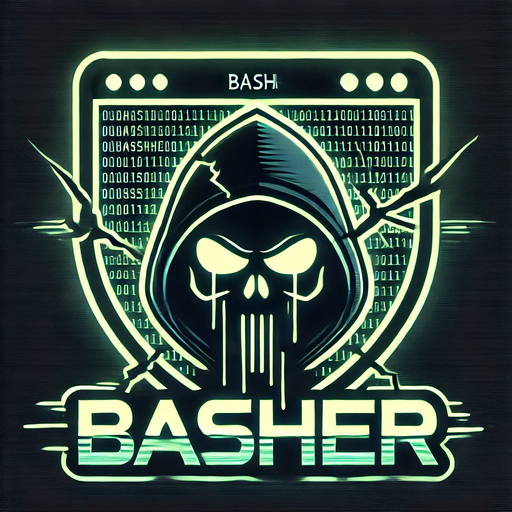
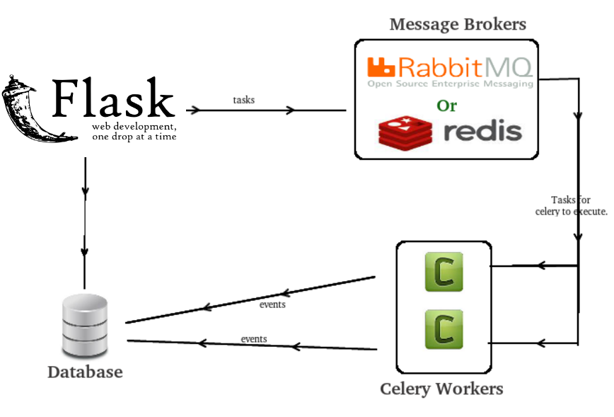

# Basher: v 0.0.1

A tool for ochestrating Nuclei.

== What is Nuclei

Nuclei is a fast, open-source, and customizable vulnerability scanner developed by ProjectDiscovery that uses templates (YAML files) to identify and report vulnerabilities in web applications, APIs, networks, and cloud configurations. 

== The problem this tool aims to solve

Following a testing engagement, it is important that we be able to check for regressions in the codebase. It is to that end that we regularly scan the environment and raise an alert, should a previously known vulnerability open up again. Nuclei fits the bill perfectly in terms of what its capabilities.

The limitation currently is in terms of ochestrating it at scale. That is where Basher steps in. The objective is to provide the end user with an ability to ochestrate nuclei, across multiple applicaitons, so as to be able to run applicaiton specific templates, and application specific API keys.

== Flask + Celery + MySQL + Nuclei for the win!

I have gone with the below architecture, since this allows for scaling, without me having to spend too much time dabbling with asynchronous code and queues.

MySQL stores the configurations for each scan. I initially played around with the idea of using a JSON configuration file. However, at scale, managing this JSON file is not feasable and one has to switch to a Database.

NOTE: This project is still in its development phase as a passion project, since I see that there is no other tool out there that does this. Please bear with me while I sort out the docs and the code!
